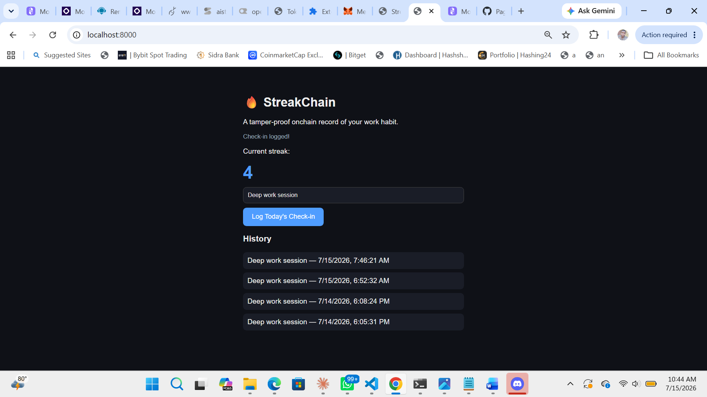

# 🔥 StreakChain

An onchain work-habit tracker, built for the [Monad Spark hackathon](https://buildanything.so/hackathons/spark).

## Problem

Sticking to a daily work habit (a focused, distraction-free work session) is hard, and it's easy to
quietly let a streak lapse when the only record of it lives in your own head — or a private app
you can edit at will.

## Solution

StreakChain lets you log a daily check-in to a smart contract on Monad testnet. Each check-in is a
timestamped, public, tamper-proof record tied to your wallet address. Your current streak is
computed directly from onchain data, so there's no faking it — and no one, including you, can quietly
edit past history.

## How it works

- **Smart contract** (`contracts/StreakChain.sol`): a small Solidity contract that stores each
  check-in (task name + block timestamp) per wallet address.
- **Frontend** (`docs/index.html`): a single static HTML page (no build step, no framework) that
  connects to MetaMask and reads/writes to the contract with ethers.js. Streaks are computed
  client-side from onchain check-in data, grouped by calendar day. Features:
  - **Today's Tasks** — add the tasks you plan to do today, check each one off to log it onchain
  - **This Week** — a Mon–Sun strip showing which days you've checked in
  - **Daily Log** — check-ins grouped by day, with current streak, longest streak, and total count
  - **Public streak lookup** — paste any wallet address to view its streak read-only, no wallet needed
  - **Copy My Streak** — share your current streak as text

## Deployed contract

- **Network:** Monad Testnet (Chain ID `10143`)
- **Address:** [`0x9668E06A1a295C9Feeef9E9b85e131efaF7171ed`](https://testnet.monadexplorer.com/address/0x9668E06A1a295C9Feeef9E9b85e131efaF7171ed)

## Running it locally

1. Clone this repo
2. Serve the `docs/` folder over HTTP (needed for MetaMask's extension to inject into the page), e.g.:
   ```
   cd docs
   python -m http.server 8000
   ```
3. Open `http://localhost:8000`, click **Connect Wallet**, and log a check-in

## Live demo

Hosted via GitHub Pages: https://muhammedzidris.github.io/streakchain/

## Screenshots



## Tech stack

- Solidity (contract)
- ethers.js v5 (frontend, loaded via CDN)
- Plain HTML/CSS/JS — no build tools
- Monad Testnet
